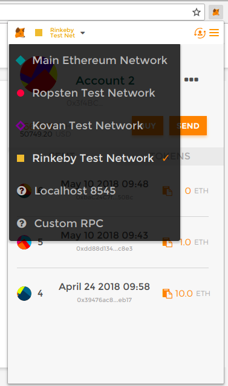
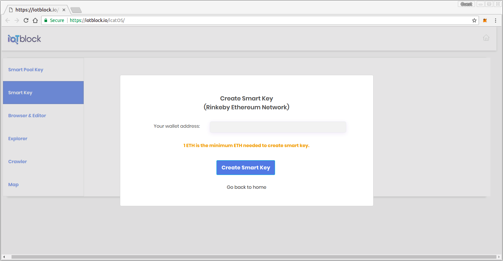
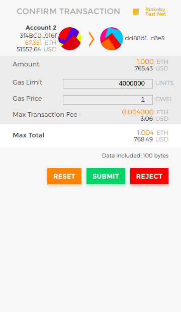
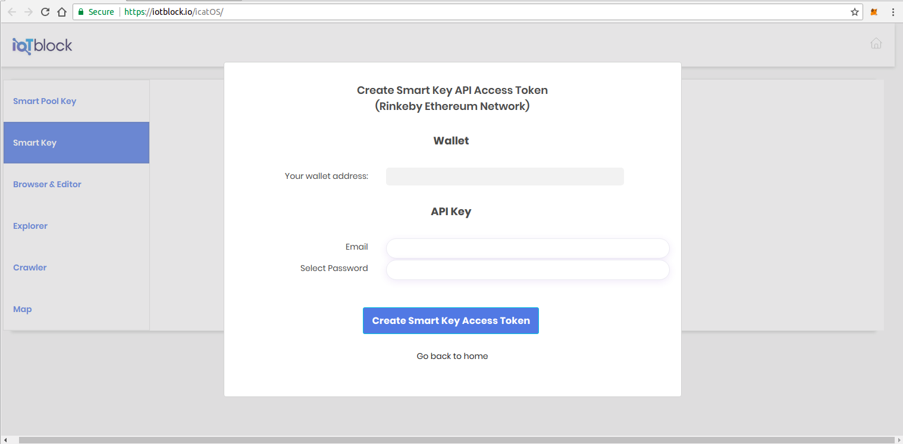
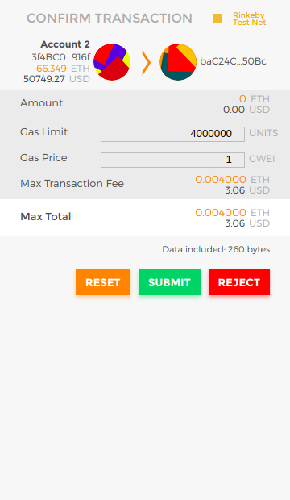
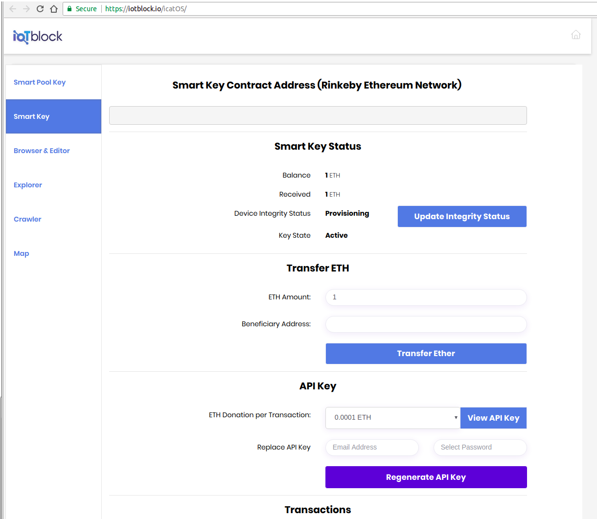

.. _web-label:

Web Interface
****************

The Universal IoT Blockchain Database Web Interface
====================================================

The Universal IoT Blockchain Database Web Interface provides browser access to IoTBlock Smart Contract and IoTBlock Hypercat API

IoTBlock's Web Interface can be accessed at <https://iotblock.io/icatOS>

Create Smart Key
====================================================

.. http:get:: https://iotblock.io/icatOS/key.html

   Get a Smart Key to access Catalogues. 1 ETH deposit is needed to create a Smart Key.

Step 1: Select Rinkeby Network on Metamask

Step 2: Confirm the address of selected wallet in Metamask

Step 3: Confirm the deposit of 1 ETH and Gas to create the Wallet

Step 4: Input Authentication Information for API Key creation

Step 5: Confirm the needed Gas to create the API Key

Step 6: Confirm the Creation of Your Key and API Access Token

Browse & Edit The Universal IoT Blockchain Database
====================================================

.. http:get:: https://iotblock.io/icatOS/browse.html

   Browse & Edit The Universal IoT Blockchain Database

Explorer
====================================================

.. http:get:: https://iotblock.io/icatOS/explorer.html

   Visually Explore the catalogues in The Universal IoT Blockchain Database

Crawler
====================================================

.. http:get:: https://iotblock.io/icatOS/crawler.html

   Crawl through the Graph Node Catalgoues and Meta Data in The Universal IoT Blockchain Database

Map
====================================================

.. http:get:: https://iotblock.io/icatOS/map.html

   Visually locate Catalogues in a map
   
